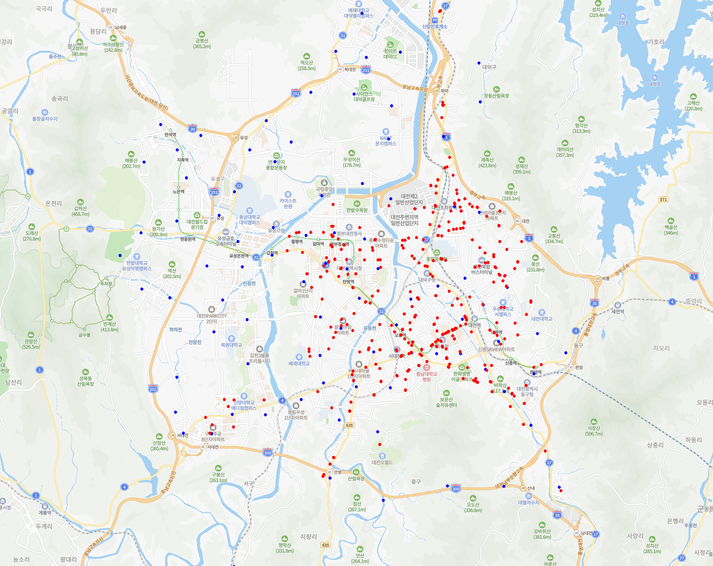

# What about this repository?
This repository is a project to efficiently place public bins. By analyzing existing public bins location data, bus station location data, and subway station location data, we determine the optimal location of additional public bins to be placed. This project aims to contribute to maintaining the cleanliness of public places and enhancing the convenience of citizens.

The bus stop location data and subway station location data were used to obtain floating population (highly populated areas), so if you have additional data, you can add it.

#Preparation
To run this project, you will need the following
* Python 3.8 or higher.
* Required Python libraries: `pandas`, `scikit-learn`, `geopy`, `tqdm`
* Data files: `recyclebin.csv`, `bus.csv`, `subway.csv` (These contain information about existing bin locations, bus stop locations, and subway station locations). The csv file must have a `latitude` column and a `longitude` column.

# Principle
This project is executed in the following steps

1. **Data import**: Import the data of existing bin locations, bus stop locations, and subway station locations.
2. **Data preprocessing**: Exclude data from locations that are too close to the existing dataset.
3. **Clustering**: Use the KMeans clustering algorithm to determine where to place public bins.
4. **Location filtering**: Use Nominatim API to check if the determined locations are within City and select the final locations by maintaining the appropriate spacing. In the [analytics.py](./analytics.py) file, the header is set to Korean, and there is a code that verifies whether the improved public trash can location is 'Daejeon Metropolitan City'. Please correct it when using it in real life.
5. **Save results**: Save the finalised locations to the improve_recyclebin.csv file.

# Example
## Location of existing public trash cans in Daejeon Metropolitan City and a location that would be good to install additionally

Red pins are an existing trash can location, and blue pins are a good location to add new ones.

# Licence
This project is distributed under the MIT licence. This means that anyone is free to use the project, including commercial and personal use, including copying, modifying, and redistributing it. For more information, see the [LICENSE file](./LICENSE).